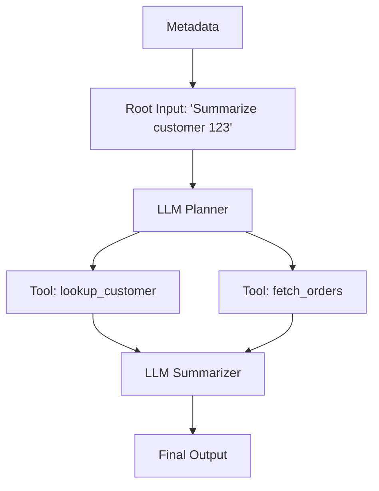

# ✈️ Agent-M² — Deterministic, Git-Friendly Regression Testing for AI Agents

**Record your agent's run once. Replay it forever — instantly, locally, for free.**

Agent-M² is a causal replay engine for LLM applications and autonomous agents. It intercepts your agent's execution at the boundaries that matter (LLM calls, tool calls), records them as a cryptographically-hashed **causal DAG** in a plain JSONL file, and replays that exact run with zero network calls. Commit the trace next to your code and every future change is regression-tested against recorded reality.

When your agent's logic drifts, Agent-M² doesn't just fail — it tells you **which call diverged, what changed, and which upstream step caused it**:

```
ReplayDivergence at tool_call_3: search_flights
Expected: {"from": "London", "limit": 5, "to": "Tokyo"}
Actual:   {"from": "London", "limit": 10, "to": "Tokyo"}
Parent:   llm_call_2: llm_plan
Likely cause: Your agent changed the arguments it generates after llm_call_2: llm_plan.
```

## Why Agent-M²

Testing AI agents is notoriously hard: they're non-deterministic, slow, and every test run costs API money. Agent-M² turns one recorded run into a permanent, deterministic test fixture:

- **Zero-cost regression tests.** Replay a complex agent flow thousands of times in CI without ever hitting the OpenAI or Anthropic APIs.
- **Causal divergence localization.** Every event is hash-pinned to its parents, so a change upstream is reported at the exact node where behavior drifted — with the responsible parent named.
- **Git-friendly by construction.** Traces are line-oriented JSONL: they diff cleanly, review in a PR, and live in `traces/` next to the code they protect.
- **Local-first.** No server, no account, no SDK lock-in. Python stdlib only; `pytest` is the sole dev dependency.

## Why not vcrpy? Why not LangSmith?

**vcrpy records HTTP. Agent-M² records causality.**

- vcrpy operates at the transport layer: it matches HTTP requests against cassettes by URL/method/body. It has no idea that request #7 exists *because of* the plan the LLM produced in request #2. When your agent changes, you get a cassette miss (`CannotOverwriteExistingCassetteException`) with no explanation of *why* the request changed — or worse, a silently wrong playback.
- Agent tool calls often aren't HTTP at all — local functions, DB queries, code execution. A transport-level recorder never sees them. Agent-M² records at the *agent boundary* (`record_llm_call` / `record_tool_call`), so every step is captured regardless of transport.
- Agent-M²'s trace is a DAG with `parent_event_ids` and content-addressed hashes: a divergence report names the exact event, the exact payload delta, and the upstream parent whose output fed it.

**LangSmith is observability. Agent-M² is regression testing.** They're complementary: LangSmith (and friends) show you what your agent did in production, on their servers. Agent-M² answers a different question — *"did my change break the recorded behavior?"* — locally, deterministically, in CI, with traces you own in git. Use both.

## 🧠 How it Works (The Causal DAG)

Instead of a flat log, Agent-M² records execution as a Directed Acyclic Graph. Every event carries `parent_event_ids` (which outputs it consumed) and a `context_hash` combining its own payload hash with its parents' hashes. Any change upstream ripples downstream — and is detected at the first affected node.

`context_hash` deliberately excludes diagnostic-only fields such as `error.traceback`, so traces remain stable across machines even when Python traceback paths differ. The traceback is still stored on failed boundary events for debugging; only stable error type/message data participates in the hash chain.

**Floats and determinism.** Hash inputs are canonical JSON: sorted keys, compact separators, and floats in Python's shortest round-trip `repr` — stable across platforms within CPython 3.10+ (`0.1 + 0.2` and `0.30000000000000004` hash identically; `1` vs `1.0` and `0.0` vs `-0.0` intentionally do not). If you need bit-exact floats across languages, store `flight_recorder.float_hex(x)` strings in payloads instead (recover with `float.fromhex`), and pass `float_policy="reject"` to both `Recorder` and `Replayer` to make any stray raw float fail loudly.



Because the trace is a DAG (not a linear log), the `TopologicalReplayer` can validate refactors that reorder *independent* branches while still failing loudly on any change that violates a recorded dependency edge.

## 🚀 Quickstart

### 1. Wrap your agent

The same agent function runs unmodified against a `Recorder` or a `Replayer` — they share one API.

```python
from flight_recorder.recorder import Recorder
from flight_recorder.replayer import Replayer

# Record once (hits live APIs)
with Recorder(agent_id="my-agent", capture_to="traces/booking.jsonl") as rr:
    run_my_agent(rr, query="Book a flight to Tokyo")

# Replay forever (instant, local, zero network calls)
with Replayer(trace_file="traces/booking.jsonl") as rr:
    run_my_agent(rr, query="Book a flight to Tokyo")
```

Optional integrations wrap popular clients so calls are captured automatically: `flight_recorder.integrations.openai.wrap_openai(...)`, plus Anthropic (`wrap_anthropic`), LangChain, LiteLLM (`wrap_litellm` — one wrapper for every provider LiteLLM routes to), and a generic HTTP wrapper for `requests` sessions (`wrap_requests`) in `flight_recorder/integrations/`.

```python
from flight_recorder.integrations.litellm import wrap_litellm
from flight_recorder.integrations.requests import wrap_requests

llm = wrap_litellm()                       # record/replay across any LiteLLM provider
response = llm.completion(model="gpt-4o-mini", messages=[...])

http = wrap_requests(requests.Session())   # generic external API calls, as tool_call events
orders = http.get("https://api.example.com/orders", timeout=10).json()
```

The `requests` wrapper records method, URL, params, headers, body, response status/headers/body, and latency; during replay the recorded response is served as a response-like object and **no real network call is made**. Sensitive headers (`Authorization`, `Cookie`, `X-Api-Key`, ...) are redacted by default before hashing or storage — session-level and call-level headers alike.

**Streaming** (`stream=True`) works transparently in the OpenAI, Anthropic, and LiteLLM wrappers: during record the chunks are buffered and folded into one deterministic aggregate (the trace is independent of how the network split the stream), and replay yields a synthetic chunk stream rebuilt from that aggregate — so `for chunk in stream:` code runs identically on both paths without touching the provider. Exact chunk boundaries are not preserved, and first-token latency during record is full-response latency (chunks are buffered before the event is written).

### Agent loops / loop engineering

For hand-rolled ReAct loops, use `LoopRun` to keep iteration names and parent
wiring readable while still writing the same underlying DAG events:

```python
from flight_recorder import LoopRun

def run_loop_agent(rr, ticket):
    loop = LoopRun.start(rr, {"ticket": ticket})

    step = loop.step()
    plan, _ = step.llm(
        "think",
        {"iteration": 1, "goal": "choose action"},
        lambda: model({"ticket": ticket}),
    )
    customer, _ = step.tool(
        "lookup_customer",
        {"customer_id": plan["customer_id"]},
        lambda: lookup_customer(plan["customer_id"]),
    )

    step = loop.step()
    reply, _ = step.tool(
        "draft_reply",
        {"customer_id": customer["id"], "tone": "friendly"},
        lambda: draft_reply(customer, tone="friendly"),
    )
    return loop.final({"reply": reply["text"]})
```

Boundary names become `step_1.think`, `step_1.lookup_customer`,
`step_2.draft_reply`, and so on, so drift in a later loop iteration points at
the exact step that changed. Use `loop.advance([...])` or explicit
`parent_event_ids` when an iteration fans out into independent tools and then
joins. If a refactor reorders independent branches, replay with
`TopologicalReplayer` so any valid DAG order still matches:

```python
from flight_recorder import TopologicalReplayer

with TopologicalReplayer("traces/support-loop.jsonl") as rr:
    run_loop_agent(rr, ticket)
```

See `examples/loop_engineering_demo.py` for a deterministic loop demo that
records once, replays with poison callables, and then shows a targeted loop
divergence.

### 2. Visualize the DAG

```bash
agent-m2 view traces/booking.jsonl
```

Renders the causal DAG to a single self-contained HTML file (no CDN, works offline) and opens it in your browser. Click any node to inspect its payload, response, hashes, and parents. Use `--no-open` in scripts and `--output out.html` to choose the destination.

### 3. Validate and replay from the CLI

All commands print exactly one machine-readable JSON object on stdout — human diagnostics go to stderr.

```bash
# Verify trace integrity: schema, DAG invariants, cryptographic hashes
agent-m2 validate traces/booking.jsonl

# Record / replay the built-in demo agent (a quick end-to-end smoke test)
agent-m2 record demo.jsonl
agent-m2 replay demo.jsonl
```

## 🛡️ Strict Replay — and When You Want Less Strict

By default, replay is **strict**: if your code requests a different prompt or different tool arguments than the trace recorded, you get a `ReplayDivergence` naming the exact event, the payload diff, and the likely upstream cause. Treat traces like contract tests: an intentional change means re-recording the baseline (a clean, reviewable diff in git).

Strictness is a dial, not a dogma:

| Mode | Matches on | Use when |
|------|-----------|----------|
| `strict` (default) | exact payload hash | locking down agent logic end-to-end |
| `structured` | JSON *shape* (keys and types, not values) | prompts contain timestamps, IDs, or other value churn |
| `semantic` | your own `semantic_matcher(recorded, actual)` callback | "close enough" needs domain judgment (e.g. embedding similarity) |

```python
Replayer(trace_file="traces/booking.jsonl", mode="structured")
```

## ⚙️ CI/CD: regression tests in GitHub Actions

Two layers of protection. First, integrity-check every committed trace. Second, replay your agent against its recorded baselines with pytest — no API keys needed in CI.

```yaml
name: agent-regression
on: [push, pull_request]

jobs:
  replay:
    runs-on: ubuntu-latest
    steps:
      - uses: actions/checkout@v4
      - uses: actions/setup-python@v5
        with:
          python-version: "3.12"
      - run: pip install -e . pytest

      # Layer 1: every committed trace is well-formed and hash-valid
      - name: Validate traces
        run: |
          for t in traces/*.jsonl; do
            agent-m2 validate "$t"
          done

      # Layer 2: replay the real agent against its recorded baselines
      - name: Replay regression tests
        run: pytest tests/test_replay_regression.py
```

And the pytest side — your actual agent code, replayed deterministically:

```python
# tests/test_replay_regression.py
import glob, pytest
from flight_recorder.replayer import Replayer
from my_agent import run_my_agent

@pytest.mark.parametrize("trace", glob.glob("traces/*.jsonl"))
def test_agent_matches_recorded_baseline(trace):
    with Replayer(trace_file=trace) as rr:
        run_my_agent(rr)  # raises ReplayDivergence on any drift
```

A failed replay exits non-zero and prints the divergence diagnosis, so the CI log tells you exactly which call drifted and why.

## 🔒 Security & Redaction

Traces end up in git, so nothing sensitive may enter them. Agent-M²'s design guarantee: **redaction runs before hashing and before storage.**

- You supply a `redactor(payload) -> redacted_payload` callback to the `Recorder`. It runs on every payload and response *before* the value is hashed or written — raw secrets never touch the trace file or any hash input.
- Pass the **same redactor** to the `Replayer`: hashes are computed over redacted payloads on both sides, so redaction never causes false divergences.
- Redaction is explicit, not magic: there is no built-in PII detector. You know your data shapes; you write the (usually tiny) callback — and it's testable like any other function.

```python
def redact(payload):
    if isinstance(payload, dict):
        return {
            k: ("[REDACTED]" if k in {"api_key", "ssn", "email"} else redact(v))
            for k, v in payload.items()
        }
    return payload

with Recorder(agent_id="my-agent", capture_to="trace.jsonl", redactor=redact) as rr:
    ...
with Replayer(trace_file="trace.jsonl", redactor=redact) as rr:
    ...
```

What's in a trace, exactly? Line-oriented JSON events: payloads and responses (post-redaction), event ids, parent ids, timestamps, and SHA-256 hashes. Run `agent-m2 view trace.jsonl` and inspect every node before you commit it.

### Tamper-evident signing (optional)

`verify_hashes` proves a trace is internally consistent, but anyone who edits it can recompute the hashes. With a secret key, every event also gets an HMAC-SHA256 `signature` that an editor cannot forge:

```python
with Recorder(agent_id="my-agent", capture_to="trace.jsonl",
              signing_key="my-secret") as rr:          # or AGENT_M2_SIGNING_KEY env var
    ...
with Replayer(trace_file="trace.jsonl", signing_key="my-secret",
              require_signatures=True) as rr:           # rejects unsigned/tampered events
    ...
```

`agent-m2 validate trace.jsonl --require-signatures` does the same check in CI (key from `AGENT_M2_SIGNING_KEY` only — never a CLI flag, to keep secrets out of shell history). Signing is fully backward compatible: without a key, traces are byte-identical to previous versions, and old unsigned traces still load and validate.

### Encrypting sensitive payloads (optional)

When redaction isn't enough — you need the real prompts for replay but can't store them in plaintext — encrypt payloads and responses at rest. Hashes and signatures are computed over the plaintext, then only the ciphertext hits disk; reading decrypts before validation and replay, so replay semantics are unchanged:

```bash
pip install "flight-recorder[crypto]"   # optional cryptography dependency (Fernet)
```

```python
from flight_recorder import load_fernet_cipher

cipher = load_fernet_cipher(key)  # key kwarg or AGENT_M2_ENCRYPTION_KEY env var
with Recorder(agent_id="my-agent", capture_to="trace.jsonl", cipher=cipher) as rr:
    ...
with Replayer(trace_file="trace.jsonl", cipher=cipher) as rr:
    ...
```

Generate a key with `cryptography.fernet.Fernet.generate_key()`. The CLI decrypts via `AGENT_M2_ENCRYPTION_KEY`; reading an encrypted trace without the key fails with a clear error. Any object with `encrypt(text) -> token` / `decrypt(token) -> text` works as a custom cipher (e.g. KMS-backed). Unencrypted traces are untouched — encryption is opt-in and backward compatible.

For large traces, use `flight_recorder.storage.iter_events(path)` to process JSONL line-by-line without loading the full file into memory. `read_events(path)` remains available as the list-returning compatibility helper.

## Application / RFS Requirements

Agent-M² can be framed as the deterministic replay and regression testing layer for production AI agents. The technical core is intentionally local-first and developer-owned, but the product surface maps cleanly to a larger reliability platform for teams shipping agents into real workflows.

### Problem Statement and Solution Approach Based on RFS

#### Problem Statement

AI agents are moving from simple chatbots into production systems that call APIs, use tools, update databases, send emails, execute code, and coordinate with other agents. These systems are difficult to debug because their behavior is not fully deterministic: a failed production run cannot always be reproduced by sending the same prompt again.

The core problem is that production AI agent failures are hard to reproduce, verify, and safely regression-test.

Traditional debugging relies on logs, stack traces, fixed inputs, and deterministic test cases. Agents break that model because each run may depend on stochastic model outputs, changing context windows, mutable databases, live third-party APIs, external tool responses, and different execution orders in multi-agent workflows.

This creates three serious engineering risks:

- **Non-reproducible failures.** When an agent fails in production, developers often cannot recreate the exact sequence of LLM calls, tool calls, API responses, and state changes that caused the failure.
- **Unsafe re-execution.** Re-running the agent may trigger duplicate API calls, repeated database writes, repeated payments, accidental emails, or additional token costs.
- **Weak regression testing.** Existing observability tools help show what happened, but they do not always let engineers replay the same production failure locally under identical historical conditions.

#### Solution Approach

Agent-M² acts like a flight recorder and replay engine for agent executions. It records an agent run once, stores every important LLM call and tool call as a causal DAG, and allows developers to replay the same run locally without contacting live APIs, databases, or LLM providers.

The approach is based on four principles:

- **Record all non-deterministic boundaries.** Agent-M² captures user input, system prompts, LLM requests, LLM responses, tool calls, tool responses, API/database responses, agent-to-agent messages, state mutations, and error events.
- **Replay without live infrastructure.** During replay, Agent-M² blocks real network calls and returns historically recorded responses, avoiding new LLM calls, duplicate mutations, accidental emails, webhooks, payments, or extra API charges.
- **Detect divergence using hashes.** Each recorded event is hashed with canonical JSON. During replay, local events are compared with historical events so the system can identify the exact drift point and the upstream cause.
- **Support strict and flexible replay.** Strict replay locks down exact reproduction. Structured replay allows value churn while checking schema. Semantic replay can use a domain-specific matcher. Manual injection and sandbox fallback can support safer debugging when live behavior must be explored.

### Overview of the Product, Technology, and Business Model

#### Product Overview

Agent-M² is a developer tool for recording, replaying, validating, and visually inspecting AI agent executions. In practice, it gives teams a way to turn a one-time production or staging run into a reusable regression fixture that can live in git, run in CI, and explain behavior drift when agent code changes.

#### Technology Overview

Agent-M² is a local-first replay engine and flight recorder for autonomous AI systems. Unlike tools that only track linear HTTP traffic, it captures the agent boundary and builds a causal DAG of every model interaction and tool execution.

- **Python core engine.** A lightweight backend orchestrates recording, hashing, storage, validation, and replay using a small Python surface area built for pytest and CI.
- **Causal DAG recording.** Each trace event includes explicit parent identifiers, so the system knows which earlier outputs triggered subsequent actions.
- **Cryptographic stability.** Argument hashes and cascading context hashes make upstream changes invalidate downstream nodes while keeping diagnostic-only fields out of the stable hash path.
- **Topological replay.** Independent DAG branches may resolve in a different order while causal dependencies remain strictly enforced.
- **Native SDK wrappers.** Built-in interceptors cover OpenAI, Anthropic, LiteLLM, LangChain, streaming calls, and generic `requests` sessions.
- **Interactive console.** The Next.js dashboard visualizes traces, lets engineers inspect raw JSON payloads, compare expected and actual events, and step through the run.

#### Workflow Integration

Agent-M² fits into a standard engineering cycle:

1. **Record once.** Wrap agent execution and generate a clean JSONL trace in the repository.
2. **Commit and diff.** Review trace changes in pull requests like any other behavioral fixture.
3. **Replay at zero cost.** Run deterministic replay in CI without network access or API keys.
4. **Debug visually.** When replay fails, open the console to inspect the causal graph and locate the upstream drift.

#### Business Model

Agent-M² can start as an open-source developer tool and expand into a commercial reliability platform.

The open-source core can include the recorder SDK, local replay engine, JSONL trace format, CLI validation, basic DAG viewer, and pytest/CI integration. This helps adoption among developers, startups, and AI engineering teams.

A paid cloud or enterprise product can add team trace dashboards, secure trace storage, role-based access control, encrypted traces, GitHub/GitLab CI integration, production trace ingestion, hosted DAG debugging, collaboration workflows, compliance logs, and agent reliability analytics.

Possible revenue streams include SaaS subscriptions, enterprise self-hosted licenses, usage-based trace storage, premium CI/CD integrations, compliance and audit packages, and support contracts.

The strongest business angle is not debugging alone. Agent-M² becomes the regression testing layer for AI agents: every serious team building production agents eventually needs a safe way to reproduce failures, control side effects, and prove that updates did not break recorded behavior.

### Market and User Perspective Assuming Global Expansion

#### Market and Users

The opportunity grows as agents move from demos into production workflows. More agents in production means more failures, higher debugging cost, more need for deterministic replay, and more need for regression testing.

Primary users:

- **AI engineers** need to debug failed agent runs quickly, avoid changing variables, identify where a failure started, and turn production bugs into regression tests.
- **Platform engineers** need safe infrastructure for agent deployment, network-isolated replay, trace validation in CI, secure storage, and auditability.
- **CTOs and engineering managers** need confidence that agent systems can be shipped safely, with lower debugging cost, better release confidence, and better governance.

Initial beachhead users include AI startups, developer-tool companies, LLM application teams, agent framework users, and YC-style startups. Expansion markets include financial services, insurance, healthcare administration, customer support automation, enterprise SaaS, legal tech, e-commerce operations, robotics, and autonomous systems.

#### Global Expansion Perspective

Agent reliability is not country-specific. Any company building production agents faces the same constraints: reliability, cost control, compliance, auditability, security, and production debugging.

Regional positioning can adapt to the buyer:

| Region | Strongest angle |
|--------|-----------------|
| United States | Developer speed, CI/CD, lower debugging cost |
| Europe | Privacy, compliance, auditability |
| Japan | Enterprise automation, reliability, robotics, controlled deployment |
| Singapore | Regional AI hub and enterprise adoption |
| Indonesia / Southeast Asia | Cost-efficient AI agent testing without repeated API calls |
| Middle East | AI infrastructure investment and government digital transformation |

The global positioning is simple: **Agent-M² is the deterministic replay and regression testing layer for production AI agents.**

## 📚 Learn more

- `examples/` — a runnable demo agent with fake LLM and tools.
- `PLAN.md` and `DESIGN-SESSION-*.md` — the recorded design history: schema, hashing, the DAG scheduler, and the deadlock-free topological replay proof.
- `tests/` — 320+ tests covering the recorder, both replay engines, redaction, and the CLI.
