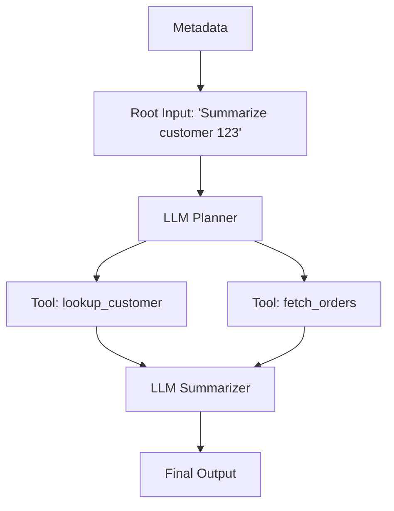

# ✈️ Agent-RR: DAG-Based Flight Recorder for AI Agents

Agent-RR is a deterministic time-travel debugger and local replay engine for LLM applications and autonomous agents. 

Testing AI agents is notoriously difficult: they are non-deterministic, slow, and expensive to run. Agent-RR solves this by intercepting your agent's execution, saving the exact sequence of LLM and tool calls as a cryptographically-hashed **Causal DAG**, and allowing you to replay that exact execution locally—instantly, deterministically, and for free.

## ✨ Why this matters

- **Zero-Cost Regression Testing:** Replay a complex agent flow thousands of times in CI without ever hitting the OpenAI or Anthropic APIs.
- **Strict Determinism:** If you change your agent's code, the Replayer will instantly detect a `ReplayDivergence`, proving exactly which payload broke the contract.
- **Privacy by Design:** Built-in callback hooks ensure API keys and PII are redacted *before* they ever reach the trace file.

## 🧠 How it Works (The DAG)

Instead of a flat log, Agent-RR records execution as a Directed Acyclic Graph (DAG) to support complex, multi-threaded agent routing without deadlocks.



Every event is cryptographically hashed (`context_hash`) combining its payload and the hashes of its parents. Any change upstream ripples downstream.

## 🚀 Quickstart

### 1. Wrap your Agent

Agent-RR provides a simple context manager that works with any LLM framework.

```python
from flight_recorder.recorder import Recorder
from flight_recorder.replayer import Replayer

# To Record (Hits live APIs)
with Recorder(agent_id="my-agent", capture_to="trace.jsonl") as rr:
    run_my_agent(rr, query="Summarize customer 123")

# To Replay (Instant, local, zero network calls)
with Replayer(trace_file="trace.jsonl") as rr:
    run_my_agent(rr, query="Summarize customer 123")
```

### 2. The CLI

Use the built-in `agent-rr` CLI for CI/CD validation. It outputs strictly machine-readable JSON.

```bash
# Validate the cryptographic hashes of a trace
agent-rr validate trace.jsonl

# Run the demo replay
agent-rr replay trace.jsonl
```

## 🛡️ Strict Replay Divergence

Agent-RR enforces **strict replay**. If your code changes and requests a different prompt or different tool arguments, the replayer will throw a `ReplayDivergence` error, telling you exactly where your agent's logic drifted from the recorded baseline.

```json
{
  "status": "divergence",
  "reason": "argument_hash mismatch",
  "expected": {"payload": {"limit": 5}},
  "actual": {"payload": {"limit": 3}}
}
```
