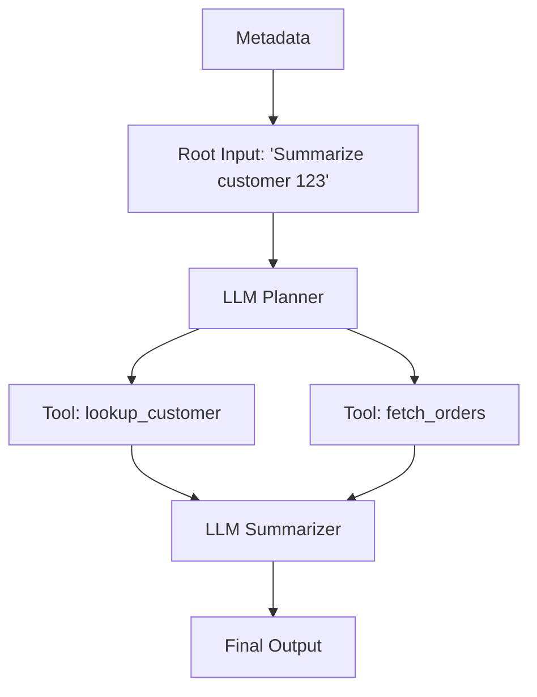

# ✈️ Agent-RR — Deterministic, Git-Friendly Regression Testing for AI Agents

**Record your agent's run once. Replay it forever — instantly, locally, for free.**

Agent-RR is a causal replay engine for LLM applications and autonomous agents. It intercepts your agent's execution at the boundaries that matter (LLM calls, tool calls), records them as a cryptographically-hashed **causal DAG** in a plain JSONL file, and replays that exact run with zero network calls. Commit the trace next to your code and every future change is regression-tested against recorded reality.

When your agent's logic drifts, Agent-RR doesn't just fail — it tells you **which call diverged, what changed, and which upstream step caused it**:

```
ReplayDivergence at tool_call_3: search_flights
Expected: {"from": "London", "limit": 5, "to": "Tokyo"}
Actual:   {"from": "London", "limit": 10, "to": "Tokyo"}
Parent:   llm_call_2: llm_plan
Likely cause: Your agent changed the arguments it generates after llm_call_2: llm_plan.
```

## Why Agent-RR

Testing AI agents is notoriously hard: they're non-deterministic, slow, and every test run costs API money. Agent-RR turns one recorded run into a permanent, deterministic test fixture:

- **Zero-cost regression tests.** Replay a complex agent flow thousands of times in CI without ever hitting the OpenAI or Anthropic APIs.
- **Causal divergence localization.** Every event is hash-pinned to its parents, so a change upstream is reported at the exact node where behavior drifted — with the responsible parent named.
- **Git-friendly by construction.** Traces are line-oriented JSONL: they diff cleanly, review in a PR, and live in `traces/` next to the code they protect.
- **Local-first.** No server, no account, no SDK lock-in. Python stdlib only; `pytest` is the sole dev dependency.

## Why not vcrpy? Why not LangSmith?

**vcrpy records HTTP. Agent-RR records causality.**

- vcrpy operates at the transport layer: it matches HTTP requests against cassettes by URL/method/body. It has no idea that request #7 exists *because of* the plan the LLM produced in request #2. When your agent changes, you get a cassette miss (`CannotOverwriteExistingCassetteException`) with no explanation of *why* the request changed — or worse, a silently wrong playback.
- Agent tool calls often aren't HTTP at all — local functions, DB queries, code execution. A transport-level recorder never sees them. Agent-RR records at the *agent boundary* (`record_llm_call` / `record_tool_call`), so every step is captured regardless of transport.
- Agent-RR's trace is a DAG with `parent_event_ids` and content-addressed hashes: a divergence report names the exact event, the exact payload delta, and the upstream parent whose output fed it.

**LangSmith is observability. Agent-RR is regression testing.** They're complementary: LangSmith (and friends) show you what your agent did in production, on their servers. Agent-RR answers a different question — *"did my change break the recorded behavior?"* — locally, deterministically, in CI, with traces you own in git. Use both.

## 🧠 How it Works (The Causal DAG)

Instead of a flat log, Agent-RR records execution as a Directed Acyclic Graph. Every event carries `parent_event_ids` (which outputs it consumed) and a `context_hash` combining its own payload hash with its parents' hashes. Any change upstream ripples downstream — and is detected at the first affected node.

`context_hash` deliberately excludes diagnostic-only fields such as `error.traceback`, so traces remain stable across machines even when Python traceback paths differ. The traceback is still stored on failed boundary events for debugging; only stable error type/message data participates in the hash chain.



Because the trace is a DAG (not a linear log), the `TopologicalReplayer` can validate refactors that reorder *independent* branches while still failing loudly on any change that violates a recorded dependency edge.

## 🚀 Quickstart

### 1. Wrap your agent

The same agent function runs unmodified against a `Recorder` or a `Replayer` — they share one API.

```python
from flight_recorder.recorder import Recorder
from flight_recorder.replayer import Replayer

# Record once (hits live APIs)
with Recorder(agent_id="my-agent", capture_to="traces/booking.jsonl") as rr:
    run_my_agent(rr, query="Book a flight to Tokyo")

# Replay forever (instant, local, zero network calls)
with Replayer(trace_file="traces/booking.jsonl") as rr:
    run_my_agent(rr, query="Book a flight to Tokyo")
```

Optional integrations wrap popular clients so calls are captured automatically: `flight_recorder.integrations.openai.wrap_openai(...)`, plus Anthropic and LangChain equivalents in `flight_recorder/integrations/`.

### 2. Visualize the DAG

```bash
agent-rr view traces/booking.jsonl
```

Renders the causal DAG to a single self-contained HTML file (no CDN, works offline) and opens it in your browser. Click any node to inspect its payload, response, hashes, and parents. Use `--no-open` in scripts and `--output out.html` to choose the destination.

### 3. Validate and replay from the CLI

All commands print exactly one machine-readable JSON object on stdout — human diagnostics go to stderr.

```bash
# Verify trace integrity: schema, DAG invariants, cryptographic hashes
agent-rr validate traces/booking.jsonl

# Record / replay the built-in demo agent (a quick end-to-end smoke test)
agent-rr record demo.jsonl
agent-rr replay demo.jsonl
```

## 🛡️ Strict Replay — and When You Want Less Strict

By default, replay is **strict**: if your code requests a different prompt or different tool arguments than the trace recorded, you get a `ReplayDivergence` naming the exact event, the payload diff, and the likely upstream cause. Treat traces like contract tests: an intentional change means re-recording the baseline (a clean, reviewable diff in git).

Strictness is a dial, not a dogma:

| Mode | Matches on | Use when |
|------|-----------|----------|
| `strict` (default) | exact payload hash | locking down agent logic end-to-end |
| `structured` | JSON *shape* (keys and types, not values) | prompts contain timestamps, IDs, or other value churn |
| `semantic` | your own `semantic_matcher(recorded, actual)` callback | "close enough" needs domain judgment (e.g. embedding similarity) |

```python
Replayer(trace_file="traces/booking.jsonl", mode="structured")
```

## ⚙️ CI/CD: regression tests in GitHub Actions

Two layers of protection. First, integrity-check every committed trace. Second, replay your agent against its recorded baselines with pytest — no API keys needed in CI.

```yaml
name: agent-regression
on: [push, pull_request]

jobs:
  replay:
    runs-on: ubuntu-latest
    steps:
      - uses: actions/checkout@v4
      - uses: actions/setup-python@v5
        with:
          python-version: "3.12"
      - run: pip install -e . pytest

      # Layer 1: every committed trace is well-formed and hash-valid
      - name: Validate traces
        run: |
          for t in traces/*.jsonl; do
            agent-rr validate "$t"
          done

      # Layer 2: replay the real agent against its recorded baselines
      - name: Replay regression tests
        run: pytest tests/test_replay_regression.py
```

And the pytest side — your actual agent code, replayed deterministically:

```python
# tests/test_replay_regression.py
import glob, pytest
from flight_recorder.replayer import Replayer
from my_agent import run_my_agent

@pytest.mark.parametrize("trace", glob.glob("traces/*.jsonl"))
def test_agent_matches_recorded_baseline(trace):
    with Replayer(trace_file=trace) as rr:
        run_my_agent(rr)  # raises ReplayDivergence on any drift
```

A failed replay exits non-zero and prints the divergence diagnosis, so the CI log tells you exactly which call drifted and why.

## 🔒 Security & Redaction

Traces end up in git, so nothing sensitive may enter them. Agent-RR's design guarantee: **redaction runs before hashing and before storage.**

- You supply a `redactor(payload) -> redacted_payload` callback to the `Recorder`. It runs on every payload and response *before* the value is hashed or written — raw secrets never touch the trace file or any hash input.
- Pass the **same redactor** to the `Replayer`: hashes are computed over redacted payloads on both sides, so redaction never causes false divergences.
- Redaction is explicit, not magic: there is no built-in PII detector. You know your data shapes; you write the (usually tiny) callback — and it's testable like any other function.

```python
def redact(payload):
    if isinstance(payload, dict):
        return {
            k: ("[REDACTED]" if k in {"api_key", "ssn", "email"} else redact(v))
            for k, v in payload.items()
        }
    return payload

with Recorder(agent_id="my-agent", capture_to="trace.jsonl", redactor=redact) as rr:
    ...
with Replayer(trace_file="trace.jsonl", redactor=redact) as rr:
    ...
```

What's in a trace, exactly? Line-oriented JSON events: payloads and responses (post-redaction), event ids, parent ids, timestamps, and SHA-256 hashes. Run `agent-rr view trace.jsonl` and inspect every node before you commit it.

For large traces, use `flight_recorder.storage.iter_events(path)` to process JSONL line-by-line without loading the full file into memory. `read_events(path)` remains available as the list-returning compatibility helper.

## 📚 Learn more

- `examples/` — a runnable demo agent with fake LLM and tools.
- `PLAN.md` and `DESIGN-SESSION-*.md` — the recorded design history: schema, hashing, the DAG scheduler, and the deadlock-free topological replay proof.
- `tests/` — 320+ tests covering the recorder, both replay engines, redaction, and the CLI.
